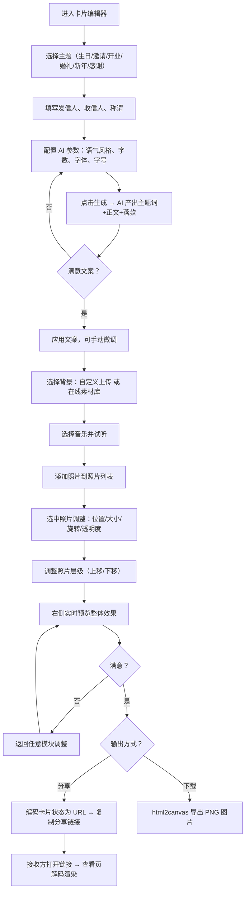

# 卡片生成器 PRD

## 1. 产品概述
卡片生成器是一款零门槛、可视化的电子卡片创作 Web 应用。支持生日庆祝、活动邀请、开业恭喜、婚礼、新年、感谢等多种主题场景，集成发信人/收信人信息录入、AI 智能文案生成（按语气风格、字数、字体、字号自动产出主题词与正文）、自定义/在线库背景、音乐搭配、多照片管理与精细化编辑（位置、大小、旋转、透明度）、侧边实时预览、分享电子卡片链接与下载为图片等完整能力，覆盖从创作到分享的全闭环。

- **目标用户**：需要在特殊场合发送贺卡、邀请函、祝贺卡的普通用户、个人创作者与小型商家
- **核心价值**：AI 辅助文案 + 可视化照片编辑 + URL 分享，让每个人都能做出有温度、可交互的电子卡片
- **差异化**：纯前端、免注册、离线可用 AI 文案引擎、卡片完整状态通过 URL 编码分享（接收方打开即见，无需账户）

## 2. 核心功能

### 2.1 用户角色
| 角色 | 注册方式 | 核心权限 |
|------|---------|---------|
| 普通用户 | 免注册即用 | 创建、编辑、预览、分享、下载卡片；本地草稿持久化 |

### 2.2 功能模块
1. **卡片编辑主页面（单页应用）**：集成主题、收发信人、AI 文案、背景、音乐、照片管理与编辑、实时预览、分享与下载全部模块
2. **卡片查看页（分享落地页）**：接收方打开分享链接，解码 URL 中卡片状态并完整呈现（含音乐自动播放控制）

### 2.3 页面详情
| 页面名称 | 模块名称 | 功能描述 |
|---------|---------|---------|
| 卡片编辑器 | 顶部导航 | Logo、主题快速切换、撤销/重做、保存草稿、重置、查看分享链接入口 |
| 卡片编辑器 | 主题选择 | 提供 6 大主题：生日庆祝、活动邀请、开业恭喜、婚礼喜帖、新年祝福、感谢致意；每主题带预设色调与示例文案 |
| 卡片编辑器 | 收发信人 | 录入发信人姓名、收信人姓名、可选称谓（如"亲爱的"/"敬爱的"）与寄语标签 |
| 卡片编辑器 | AI 文案生成 | 输入参数：主题、语气风格（温馨/幽默/正式/诗意/俏皮）、字数（30-300 滑块）、字体（下拉选择中英文字体）、字号（12-48px）；点击生成后产出主题词、正文段落、落款，可一键应用或重新生成；支持手动微调编辑 |
| 卡片编辑器 | 背景设置 | 两种来源：①自定义上传本地图片（支持 JPG/PNG）；②在线素材库预设背景（按主题分类的渐变/纹理/实景图）；支持背景遮罩颜色与不透明度调节 |
| 卡片编辑器 | 音乐搭配 | 在线音乐库（按主题/情绪分类的轻音乐片段），可试听、选用、关闭；卡片查看页支持播放控制 |
| 卡片编辑器 | 照片管理 | 添加多张照片（上传本地图片）；列表式管理面板：缩略图 + 名称 + 显示/隐藏开关 + 复制 + 删除；支持上下移动调整层级（zIndex） |
| 卡片编辑器 | 照片编辑 | 选中照片后可调：位置（拖拽 / X-Y 数值）、大小（拖拽缩放手柄 / 宽度百分比滑块）、旋转角度（-180°~180° 滑块）、透明度（0-1 滑块）；选中态显示控制框与手柄 |
| 卡片编辑器 | 实时预览 | 右侧固定预览栏：缩略图同步显示卡片当前状态；支持桌面/移动两种预览比例切换 |
| 卡片编辑器 | 分享与下载 | ①分享：将卡片完整状态序列化为 JSON→Base64→URL，生成 `/view/:data` 链接，一键复制；②下载：使用 html2canvas 将卡片画布导出为 PNG 图片，文件名带主题与日期 |
| 卡片查看页 | 卡片展示 | 解码 URL 数据，渲染卡片（背景、文字、照片、音乐播放控件）；顶部提示"这是一张电子卡片"与发信人 |

## 3. 核心流程

**创作流程**：进入编辑器 → 选择主题 → 填写收发信人 → 配置 AI 参数（语气/字数/字体/字号）→ 生成并应用文案 → 选择背景（自定义或在线库）→ 选择音乐并试听 → 添加照片到列表 → 选中照片编辑位置/大小/旋转/透明度 → 调整照片层级 → 右侧实时预览 → 满意后分享链接或下载图片。

**分享流程**：点击分享 → 系统编码卡片状态为 URL → 复制链接 → 接收方打开 → 卡片查看页解码渲染 → 可播放音乐/查看照片。

## 4. 用户界面设计

### 4.1 设计风格
- **整体风格**：现代极简编辑器 + 卡片温馨感，专业与温度平衡；参考 Figma/Canva 编辑器的清晰信息层级，但用更暖的配色与衬线标题区别于冷感工具
- **主色调**：
  - 米白底 `#FAF7F2`
  - 墨黑主文字 `#1A1A1A`
  - 赤陶橙强调色 `#D97757`（主按钮、选中态）
  - 雾绿次要色 `#7A9B83`（成功/音乐）
  - 浅灰描边 `#E8E3DA`
- **按钮风格**：圆角 8px；主按钮实心填充 + 悬浮微抬升阴影；次按钮描边；图标按钮圆形 36px
- **字体**：
  - 标题用 `Playfair Display`（衬线优雅）+ 中文 `Noto Serif SC`
  - 正文 UI 用 `Noto Sans SC`（清晰可读）
  - 卡片内文字提供字体下拉：思源宋体、思源黑体、楷体、Playfair、Dancing Script、Caveat 等中英文选择
- **布局**：桌面优先三栏 — 左侧控制面板（320px，Tab 切换：主题/文案/背景/音乐/照片）+ 中央卡片画布（弹性居中）+ 右侧预览与操作栏（280px）
- **图标**：lucide-react 线性图标，统一 1.5px 描边
- **动效**：framer-motion 实现 Tab 切换淡入、照片选中缩放、生成按钮加载态、预览同步过渡

### 4.2 页面设计概览
| 页面名称 | 模块名称 | UI 元素 |
|---------|---------|---------|
| 卡片编辑器 | 顶部导航 | 左侧 Logo+名称；中间主题快速切换胶囊；右侧撤销/重做/保存/重置/分享图标按钮 |
| 卡片编辑器 | 左侧控制面板 | 顶部 5 个 Tab（主题/文案/背景/音乐/照片）；每 Tab 内为表单控件 + 素材网格；可滚动 |
| 卡片编辑器 | 中央画布 | 卡片实时渲染区（默认 4:3 或 3:4 可切）；照片可拖拽/缩放/旋转；选中态虚线框 + 角点手柄；背景与文字叠加 |
| 卡片编辑器 | 右侧预览栏 | 缩略预览图（同步实时）、桌面/移动比例切换、分享链接按钮、下载图片按钮、音乐播放控件 |
| 卡片编辑器 | 照片列表 | 缩略图 + 文件名 + 显示/隐藏开关 + 复制 + 删除 + 上移/下移层级按钮 |
| 卡片查看页 | 卡片展示 | 居中卡片、顶部发信人提示、底部音乐播放条、关闭按钮 |

### 4.3 响应式
- **桌面优先（≥1280px）**：三栏并排布局，完整功能，画布大尺寸
- **平板（768-1279px）**：左右面板折叠为可展开抽屉（抽屉按钮），画布居中占主区
- **移动端（<768px）**：单栏堆叠；底部固定 Tab 切换控制面板（半屏抽屉）；画布上方固定；预览改为全屏弹窗触发

### 4.4 3D 场景指引
不适用（本项目无 3D 场景需求）。

## 5. 非功能性需求
- **性能**：照片编辑拖拽流畅（60fps）；AI 文案生成 < 200ms；导出 PNG < 3s
- **兼容性**：Chrome/Edge/Safari/Firefox 最新两版本
- **可用性**：所有操作可撤销/重做；草稿自动保存至 LocalStorage（每 5s 或变更时）
- **无障碍**：键盘可操作主要控件；图标按钮带 aria-label
