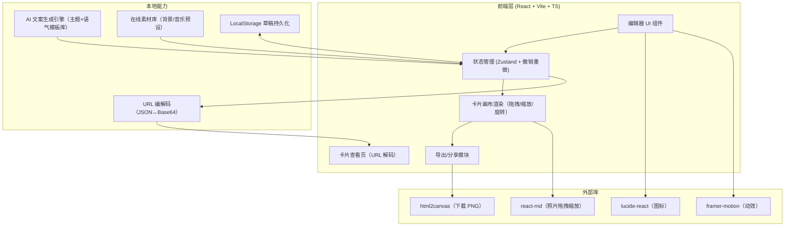
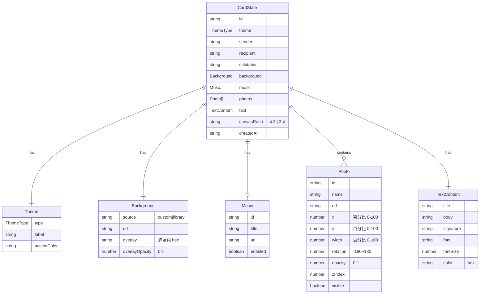

# 卡片生成器 技术架构

## 1. 架构设计



## 2. 技术说明
- **前端框架**：React@18 + Vite + TypeScript
- **样式方案**：TailwindCSS@3
- **状态管理**：Zustand（含临时历史栈实现撤销/重做）
- **图标库**：lucide-react
- **动效库**：framer-motion
- **照片交互**：react-rnd（拖拽 + 缩放手柄），旋转通过 CSS transform 叠加
- **图片导出**：html2canvas（将卡片 DOM 节点转为 PNG 下载）
- **分享机制**：`JSON.stringify(cardState)` → `btoa(encodeURIComponent(...))` → 拼 `/view/:data`；查看页 `decodeURIComponent(atob(...))` 还原
- **AI 文案生成**：本地 `src/lib/aiGenerator.ts`，构建主题×语气矩阵的句式模板库 + 随机组合 + 字数裁剪算法，根据参数即时生成，离线可用、零成本
- **草稿持久化**：Zustand middleware `persist` 写入 LocalStorage，key 为 `cardgen:draft`
- **初始化工具**：vite-init（react-ts 模板）
- **后端**：无（纯前端应用）
- **数据库**：无

## 3. 路由定义
| 路由 | 用途 |
|------|------|
| `/` | 卡片编辑器主页面（创作与编辑） |
| `/view/:data` | 卡片查看页（解码 URL 中的 Base64 卡片数据并展示，用于分享链接） |

## 4. API 定义
本项目为纯前端应用，无后端 API。核心本地函数：

### 4.1 AI 文案生成
```typescript
type ThemeType = 'birthday' | 'invitation' | 'opening' | 'wedding' | 'newyear' | 'thanks';
type ToneType = 'warm' | 'humor' | 'formal' | 'poetic' | 'playful';

interface GenerateParams {
  theme: ThemeType;
  tone: ToneType;
  wordCount: number;        // 30-300
  font: string;             // 字体族标识
  fontSize: number;         // 12-48 px
  sender: string;
  recipient: string;
  salutation?: string;      // 称谓
}

interface GeneratedContent {
  title: string;            // 主题词
  body: string;             // 正文段落
  signature: string;        // 落款
}

function generateContent(params: GenerateParams): GeneratedContent;
```

### 4.2 URL 编解码
```typescript
function encodeCardToUrl(state: CardState): string;   // 返回 Base64 字符串
function decodeCardFromUrl(data: string): CardState | null;
```

### 4.3 图片导出
```typescript
async function exportCardAsImage(node: HTMLElement, filename: string): Promise<void>;
```

## 5. 服务端架构
不适用（纯前端应用，无服务端）。

## 6. 数据模型

### 6.1 数据模型定义



### 6.2 数据定义语言
不适用（无数据库，数据以 JSON 形式存储于 Zustand store 与 LocalStorage）。

## 7. 关键实现要点

### 7.1 撤销/重做
Zustand store 维护 `past: CardState[]`、`present: CardState`、`future: CardState[]`；每次变更将旧 present 推入 past，清空 future；撤销则 past 栈顶→present，原 present→future；重做反之。

### 7.2 照片交互
使用 `react-rnd` 实现拖拽与缩放；旋转通过外层 `transform: rotate()` 叠加；选中态由 store 的 `selectedPhotoId` 控制，画布渲染选中框与角点手柄。

### 7.3 AI 文案引擎
`src/lib/aiGenerator.ts` 内建数据结构：
```typescript
const TEMPLATES: Record<ThemeType, Record<ToneType, {
  titles: string[];
  bodies: string[];   // 句式片段，含 {recipient}/{sender} 占位
  signatures: string[];
}>> = { ... };
```
生成逻辑：按 theme+tone 取模板 → 随机组合标题/正文片段 → 按 wordCount 裁剪或拼接 → 替换占位符 → 返回。

### 7.4 在线素材库
`src/lib/assets.ts` 导出预设背景（Unsplash/Picsum URL）与音乐（免费 CC0 音频 URL）列表，按主题分类。

### 7.5 html2canvas 导出注意
导出前临时移除选中框、手柄等编辑态 UI；对外部图片需配置 `useCORS: true`；导出后恢复编辑态。
